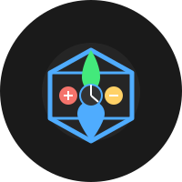

# NuTetra Controller

A complete hydroponics automation system for the Raspberry Pi 5, designed to monitor and control nutrient solutions for optimal plant growth.



## Features

- Real-time monitoring of pH, EC (electrical conductivity), and temperature
- Automated dosing system for nutrients and pH adjustments
- User-friendly web interface with dark theme
- Historical data visualization with interactive charts
- Notification system via email, SMS, and web interface
- Backup and restore functionality for system settings
- Responsive design for desktop and mobile devices

## Hardware Requirements

- Raspberry Pi 5 (recommended) or Raspberry Pi 4
- pH sensor (compatible with Atlas Scientific pH EZO or similar)
- EC sensor (compatible with Atlas Scientific EC EZO or similar)
- Temperature sensor (DS18B20 or similar)
- Peristaltic pumps for nutrient and pH adjustment dosing
- Relay board for controlling pumps (if not using PWM-controlled pumps)

## Software Requirements

- Python 3.7+
- Flask web framework
- SQLite database
- RPi.GPIO for Raspberry Pi GPIO control
- Socket.IO for real-time updates

## Installation

### Option 1: Install from source

1. Clone the repository:
```bash
git clone https://github.com/simcoreservers/nutetra.git
cd nutetra
```

2. Create and activate a virtual environment:
```bash
python -m venv venv
source venv/bin/activate  # On Windows, use: venv\Scripts\activate
```

3. Install dependencies:
```bash
pip install -r requirements.txt
```

4. Set up the database:
```bash
flask init-db
```

5. Run the application:
```bash
python run.py
```

### Option 2: Install using Docker

1. Clone the repository:
```bash
git clone https://github.com/yourusername/nutetra.git
cd nutetra
```

2. Build and run the Docker container:
```bash
docker build -t nutetra .
docker run -p 5000:5000 --privileged nutetra
```

## Configuration

1. Access the web interface at `http://nutetra.local:5000`
2. Navigate to Settings to configure:
   - Sensor calibration
   - Target values for pH, EC, and temperature
   - Dosing parameters
   - Notification preferences
   - System preferences

## Sensor Calibration

For accurate readings, it's important to calibrate your sensors:

### pH Sensor Calibration
1. Navigate to Sensors > pH Sensor
2. Follow the on-screen instructions for 2-point or 3-point calibration
3. Use standard calibration solutions (pH 4.0, 7.0, and 10.0)

### EC Sensor Calibration
1. Navigate to Sensors > EC Sensor
2. Follow the on-screen instructions for calibration
3. Use standard calibration solutions (typically 1413 μS/cm and 12880 μS/cm)

## Dosing System Setup

1. Navigate to Dosing > Pump Configuration
2. Add each pump connected to your system:
   - Assign a name (e.g., "pH Down", "Nutrient A")
   - Select the GPIO pin connected to the pump
   - Set the flow rate in ml/min
   - Enable or disable each pump

## API Access

NuTetra Controller provides a RESTful API for integration with other systems:

- `/api/sensor-current` - Get current sensor readings
- `/api/sensor-history` - Get historical sensor data
- `/api/notifications` - Get recent notifications
- `/api/dose` - Trigger manual dosing
- `/api/system-stats` - Get system statistics

See the API documentation in the Settings > API section of the web interface for more details.

## Development

### Project Structure

```
nutetra/
├── app/
│   ├── controllers/       # Route handlers
│   ├── models/            # Database models
│   ├── static/            # Static assets (CSS, JS, images)
│   ├── templates/         # HTML templates
│   ├── utils/             # Utility functions
│   └── __init__.py        # Application factory
├── instance/              # Instance-specific data
├── logs/                  # Application logs
├── requirements.txt       # Python dependencies
└── run.py                 # Application entry point
```

### Running in Development Mode

```bash
export FLASK_ENV=development
python run.py
```

## Troubleshooting

### Sensor Connection Issues
- Check physical connections between sensors and Raspberry Pi
- Verify I2C is enabled on your Raspberry Pi: `sudo raspi-config`
- Check sensor addresses: `i2cdetect -y 1`

### Pump Issues
- Verify GPIO pins are correctly configured
- Check relay connections
- Test pumps manually through the Dosing interface

### System Won't Start
- Check logs in the `logs/` directory
- Verify permissions: `sudo chmod +x run.py`
- Check Python version: `python --version`

## License

This project is licensed under the MIT License - see the LICENSE file for details.

## Acknowledgements

- [Flask](https://flask.palletsprojects.com/)
- [Chart.js](https://www.chartjs.org/)
- [Socket.IO](https://socket.io/)
- [RPi.GPIO](https://pypi.org/project/RPi.GPIO/) 